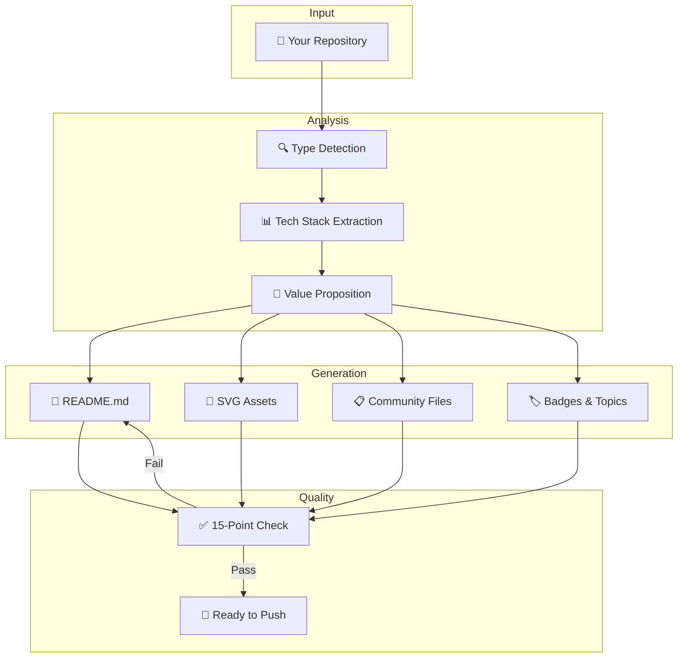

<div align="center">

<!-- Hero Banner — 用 PNG 保证 GitHub 渲染兼容 -->


# ✨ Repo Showcase

### Your AI agent's secret weapon for GitHub stardom

**Codex / Claude Code Skill that automatically transforms any repository into a professional, eye-catching showcase page**

[](https://github.com/gtskevin/repo-showcase#installation)
[](https://github.com/gtskevin/repo-showcase/blob/main/LICENSE)
[](https://github.com/gtskevin/repo-showcase/stargazers)
[](https://github.com/gtskevin/repo-showcase/commits/main)

[](https://github.com/gtskevin/repo-showcase#quick-start)
[](https://github.com/gtskevin/repo-showcase#quick-start)

<p>
  <a href="README.md">🇺🇸 English</a> · <a href="README.zh-CN.md">🇨🇳 简体中文</a>
</p>

</div>

---

## 🔥 Before → After

> See what this skill actually does to a real repository:

<table>
<tr>
<td width="50%" valign="top">

### ❌ Before (generic agent output)
```
# my-tool
A tool for processing data.
## Install
npm install my-tool
## Usage
import { process } from 'my-tool'
process(data)
## License
MIT
```

*Flat, no visual appeal, no badges, no social proof. Visitors leave in 3 seconds.*

</td>
<td width="50%" valign="top">

### ✅ After (repo-showcase applied)

`# ✨ my-tool`
*Process data 10x faster with zero config*

`[](link) [](link) [](link)`

**🚀 Highlights** · **⚡ 30s Quick Start** · **📊 Comparison Table** · **🎬 Live Demo** · **❓ FAQ** · **⭐ Star History**

*Professional, conversion-optimized, with social proof and clear value prop. Visitors stay, explore, and star.*

</td>
</tr>
</table>

**One prompt. 22 files generated. 15 quality checks passed. Zero manual effort.**

---

## ⭐ Why People Star Repos

> Research-backed: repos that do these 5 things get **3-5x more stars** than those that don't.

| # | Tactic | This Skill Does It? |
|---|--------|:---:|
| 1 | **Visual hook in first 3 seconds** (banner, logo, clear tagline) | ✅ Auto-generated SVGs |
| 2 | **Social proof early** (stars, downloads, "used by") | ✅ Proof Bar section |
| 3 | **Quick Start under 60 seconds** (with expected output) | ✅ Template-driven |
| 4 | **og:image for social sharing** (Twitter, Slack, WeChat preview) | ✅ 1200×630 SVG |
| 5 | **Community signals** (issue templates, contributing guide, CoC) | ✅ 7 files auto-generated |

---

## 🎬 Demo: What Gets Generated

```
your-repo/                           your-repo/ (after repo-showcase)
├── src/                             ├── src/
├── package.json                     ├── package.json
└── README.md  (3 lines)             ├── README.md  (professional, 200+ lines)
                                     ├── .github/
                                     │   ├── assets/
                                     │   │   ├── logo.svg          ← auto-generated
                                     │   │   ├── banner.svg        ← auto-generated
                                     │   │   └── screenshot-*.png  ← you add
                                     │   ├── social-preview.svg    ← og:image
                                     │   ├── ISSUE_TEMPLATE/
                                     │   │   ├── bug_report.md
                                     │   │   └── feature_request.md
                                     │   ├── PULL_REQUEST_TEMPLATE.md
                                     │   └── FUNDING.yml
                                     ├── CONTRIBUTING.md
                                     ├── CODE_OF_CONDUCT.md
                                     └── SECURITY.md
```

---

## ⚡ Quick Start

⏱️ **Get started in 30 seconds**

```bash
# 1. Install — clone into your Codex skills directory
git clone https://github.com/gtskevin/repo-showcase.git ~/.codex/skills/repo-showcase

# 2. Use — just ask in any project
```

Then open Codex / Claude Code in any project and say:

```
"Beautify my GitHub repo before I publish it"
```

**Expected output:**
```
🔍 Analyzing repository...
   → Type: NPM Library (TypeScript)
   → Target audience: Frontend developers
   → 3 competitors detected

📝 Generating showcase files...
   → README.md (16 sections, conversion-optimized)
   → .github/assets/logo.svg (dark mode compatible)
   → .github/assets/banner.svg (800×200)
   → .github/social-preview.svg (1200×630 og:image)
   → 5 community files (issue templates, PR template, etc.)

✅ Quality check: 15/15 passed
🚀 Ready to push!
```

---

## 🎯 Supported Repo Types

| Type | Auto-Detected By | Showcase Focus |
|------|-----------------|----------------|
| 🤖 **AI Skill** (Codex/Claude Code) | `SKILL.md` present | Example prompts · Install cmd · Dual audience (human + agent) |
| 🌐 **Web App** | Frontend framework config | Screenshots · Live demo link · Deploy button |
| 📦 **NPM / Python Library** | `package.json` / `pyproject.toml` | 5-Minute Win snippet · Bundle size · Multi-pkg install |
| ⌨️ **CLI Tool** | `bin` field | ASCII art · Terminal demo · Command reference |

---

## 📖 What the Skill Does

### 🏗️ Phase 1: Analysis
- Detects repo type from file signatures
- Extracts tech stack, dependencies, and framework
- Identifies core value proposition
- Determines target audience

### 🎨 Phase 2: Generation

| Output | Description |
|--------|-------------|
| **README.md** | 16-section conversion-optimized showcase |
| **SVG Logo** | Clean geometric design, dark mode aware |
| **SVG Banner** | Gradient hero with project name |
| **Social Preview** | 1200×630 og:image for link sharing |
| **Badge URLs** | shields.io badges matched to ecosystem |
| **Topics** | Up to 20 GitHub Topics for discoverability |
| **Community Files** | Issue templates, PR template, CONTRIBUTING, SECURITY, CoC |

### ✅ Phase 3: Quality Assurance

```bash
# Run the 15-point quality check on any README
python3 scripts/quality_check.py README.md
```

```
📋 README Quality Report: 15/15 checks passed

  ✅ [PASS] Hero Section
  ✅ [PASS] Tagline
  ✅ [PASS] Badges
  ✅ [PASS] Quick Start
  ✅ [PASS] Features/Highlights
  ✅ [PASS] Star History
  ✅ [PASS] Contributing
  ✅ [PASS] Footer
  ✅ [PASS] No Badge Wall
  ✅ [PASS] No Placeholders
  ✅ [PASS] Image Alt Text
  ✅ [PASS] Dark Mode Support
  ✅ [PASS] Collapsible Sections
  ✅ [PASS] Social Proof Early
  ✅ [PASS] Time Commitment
```

---

## 🏆 Honest Comparison

> We believe in transparency. Here's how we compare — and where alternatives might be better for you.

| Capability | **Repo Showcase** | readme-ai | Profile README Gen |
|------------|:---:|:---:|:---:|
| AI Agent integration (Codex/Claude) | ✅ Native skill | ❌ CLI only | ❌ Web only |
| AI Skill repo support | ✅ Dual-audience | ❌ Generic | ❌ N/A |
| SVG auto-generation | ✅ Logo + banner + og:image | ❌ Text only | ⚠️ Templates |
| Dark mode support | ✅ Built-in | ❌ No | ❌ No |
| Community files | ✅ 7 templates | ❌ No | ❌ No |
| Quality self-check | ✅ 15 checks | ❌ No | ❌ No |
| GitHub SEO (Topics, About) | ✅ Yes | ❌ No | ❌ No |
| Standalone CLI usage | ❌ Agent required | ✅ Yes | ✅ Yes |
| Template variety | ⚡ Growing | ✅ Many | ⚠️ Limited |

> 💡 **Choose readme-ai if:** You want a standalone CLI tool without needing an AI agent.
> 💡 **Choose this skill if:** You use Codex/Claude Code and want the full showcase pipeline automated.

---

## 🏗️ Architecture



---

## ❓ FAQ

<details>
<summary>🤔 Does this work with Claude Code or only Codex?</summary>

Works with both! It's a standard SKILL.md-based skill compatible with any AI coding agent that supports skills.
</details>

<details>
<summary>🛡️ Will it overwrite my existing README?</summary>

It asks before overwriting. You can also ask it to "enhance" or "add to" your existing README instead of replacing it.
</details>

<details>
<summary>🎨 Can I customize the generated assets?</summary>

Absolutely! Edit files in `references/` to change templates, or modify the generated SVGs directly. The skill reads templates at runtime.
</details>

<details>
<summary>📊 How does the quality check work?</summary>

Run `python3 scripts/quality_check.py README.md` — it checks 15 criteria across critical/important/nice-to-have levels and suggests specific fixes for failures.
</details>

<details>
<summary>🔄 What if my repo is a hybrid type?</summary>

The skill detects the dominant type and merges relevant sections. For example, a CLI tool with a web dashboard gets both command reference AND screenshot sections.
</details>

<details>
<summary>🌐 Does it support non-English repos?</summary>

Yes! It generates bilingual READMEs when it detects non-English content or when you ask. Currently supports English + Chinese, and can be extended to other languages.
</details>

---

## 🤝 Contributing

We'd love your help! Whether it's a bug report, feature request, or code contribution — every bit counts.

- 🐛 [Report a bug](https://github.com/gtskevin/repo-showcase/issues/new?template=bug_report.md)
- 💡 [Request a feature](https://github.com/gtskevin/repo-showcase/issues/new?template=feature_request.md)
- 🔧 [Browse good first issues](https://github.com/gtskevin/repo-showcase/labels/good%20first%20issue)
- 📖 Read the [Contributing Guide](CONTRIBUTING.md)

---

## ⭐ Star History

If this skill saved you time, consider giving it a ⭐ — it helps others discover it!

[](https://star-history.com/#gtskevin/repo-showcase&Date)

---

<div align="center">

**Built with ❤️ by [@gtskevin](https://github.com/gtskevin)**

*Making every repository shine ✨*

[⬆ Back to top](#-repo-showcase)

</div>
